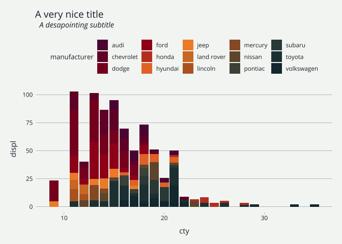

<!-- README.md is generated from README.Rmd. Please edit that file -->

# mediocrethemes

<!-- badges: start -->

<!-- badges: end -->

This package provides not particularly nice and, hopefully, not
particularly hugly ggplot themes.

## Installation

You can install the development version of `mediocrethemes` from
[GitHub](https://github.com/) with:

``` r
# install.packages("devtools")
# devtools::install_github(" vincentbagilet/mediocrethemes")
```

## Example

Here are a couple of example plots obtained with this theme.

``` r
library(ggplot2)
library(mediocrethemes)

ggplot(data = ggplot2::mpg, aes(x = cty, y = displ)) +
    geom_point() +
    theme_mediocre() +
    labs(title = "A very nice title", subtitle = "A desapointing subtitle")
```


``` r

ggplot(data = ggplot2::mpg, aes(x = cty, y = displ, fill = manufacturer)) +
    geom_col() +
    theme_mediocre() +
    scale_mediocre_d() +
    labs(title = "A very nice title", subtitle = "A desapointing subtitle")
```



## Usage

This package provides both a ggplot theme and a color palette. Users can
either set the theme and color palatette as done in the previous
examples or they can set the theme and color palette for all plots in a
document by using the function `set_mediocre_all` at the top of their
document:

``` r
set_mediocre_all()
```
