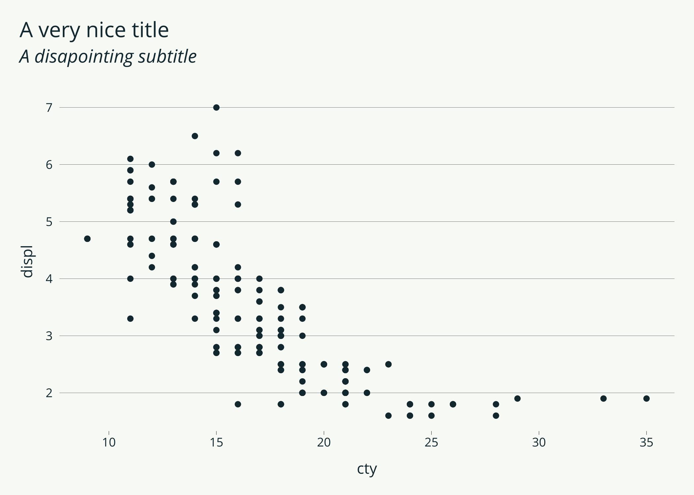
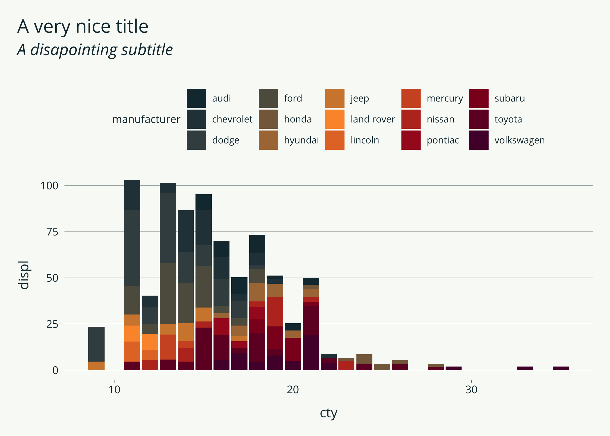
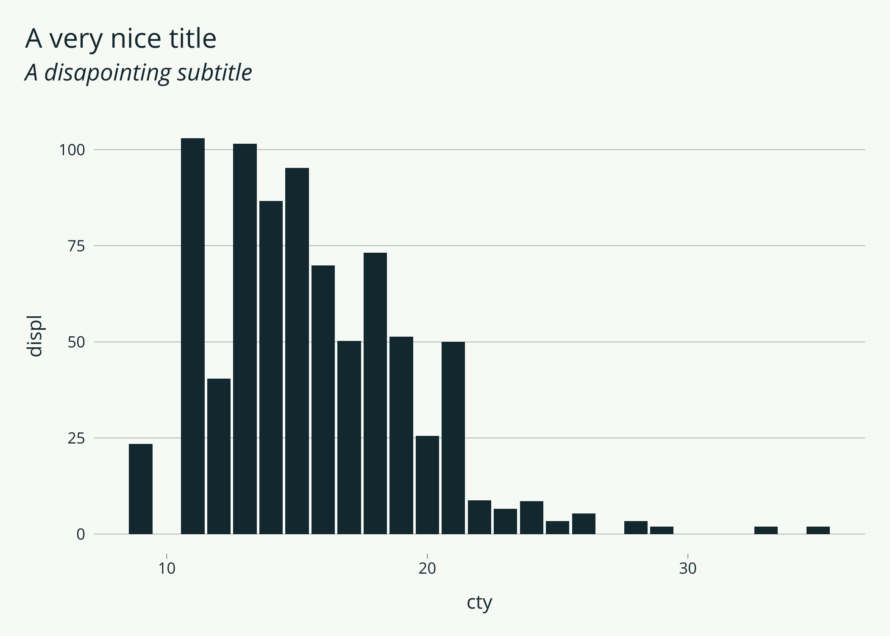
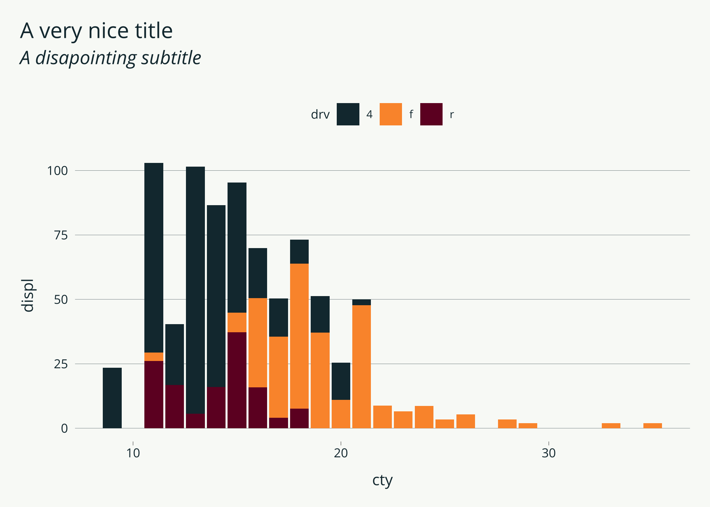
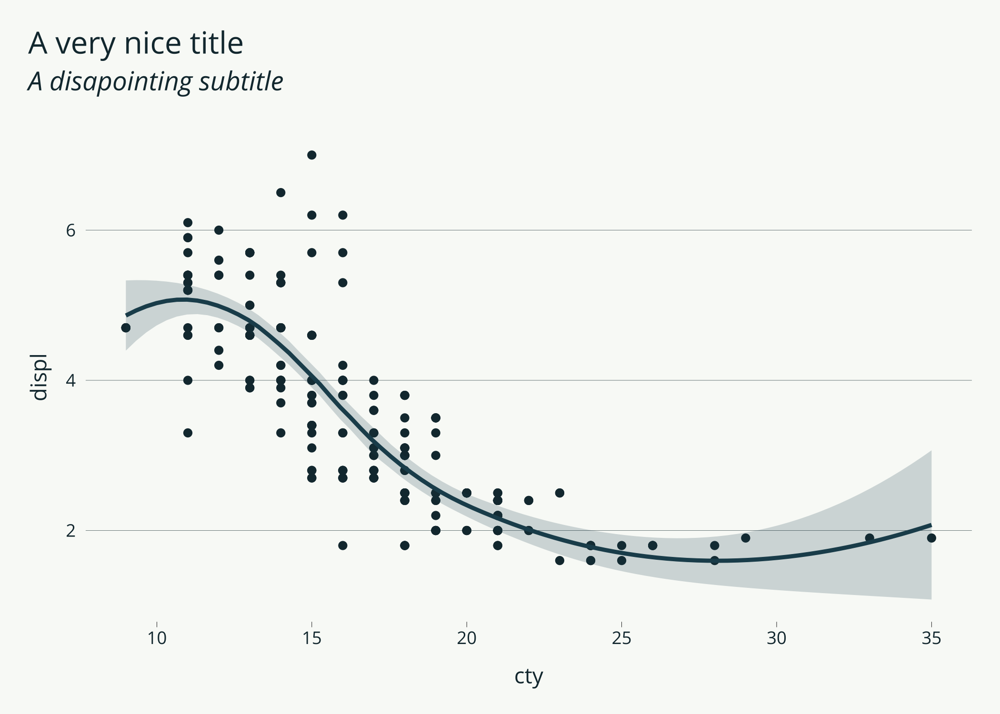
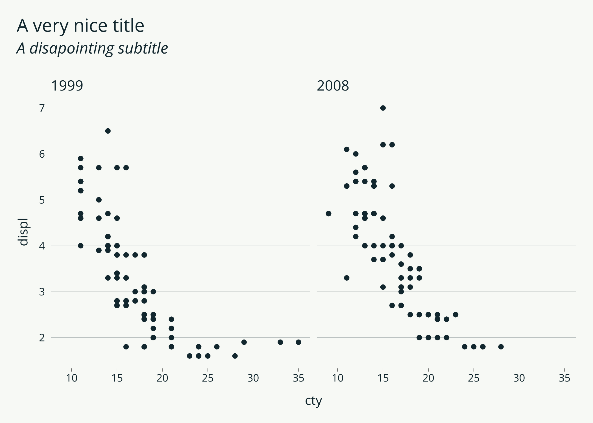

<!-- README.md is generated from README.Rmd. Please edit that file -->

# mediocrethemes

<!-- badges: start -->

<!-- badges: end -->

This package provides not particularly nice and, hopefully, not
particularly ugly ggplot themes.

## Installation

You can install the development version of `mediocrethemes` from
[GitHub](https://github.com/) with:

``` r
# install.packages("devtools")
# devtools::install_github(" vincentbagilet/mediocrethemes")
```

## Usage

This package provides both a ggplot theme and a color palette. Users can
set the theme and color palatette..

``` r
library(ggplot2)
library(mediocrethemes)

ggplot(data = ggplot2::mpg, aes(x = cty, y = displ)) +
    geom_point() +
    theme_mediocre() +
    scale_mediocre_d() +
    labs(title = "A very nice title", subtitle = "A disapointing subtitle")
```



Users can set the theme and color palette for all plots in a document by
using the function `set_mediocre_all` at the top of their document:

``` r
set_mediocre_all()

ggplot(data = ggplot2::mpg, aes(x = cty, y = displ, fill = manufacturer)) +
    geom_col() +
    labs(title = "A very nice title", subtitle = "A disapointing subtitle")
```



## Examples

Here are a couple of example plots obtained with this theme.

``` r
ggplot(data = ggplot2::mpg, aes(x = cty, y = displ)) +
    geom_col() +
    labs(title = "A very nice title", subtitle = "A disapointing subtitle")
```



``` r

ggplot(data = ggplot2::mpg, aes(x = cty, y = displ, fill = drv)) +
  geom_col() +
  labs(title = "A very nice title", subtitle = "A disapointing subtitle")
```



``` r

ggplot(data = ggplot2::mpg, aes(x = cty, y = displ)) +
  geom_point() +
  geom_smooth() +
  labs(title = "A very nice title", subtitle = "A disapointing subtitle")
#> `geom_smooth()` using method = 'loess' and formula 'y ~ x'
```



``` r

df <- data.frame(
  x = rnorm(10000),
  y = rnorm(10000)
)

ggplot(df, aes(x, y)) +
  geom_hex() +
  coord_fixed() +
  labs(title = "A very nice title", subtitle = "A disapointing subtitle")
```


``` r

ggplot(data = ggplot2::mpg, aes(x = cty, y = displ)) +
  geom_point() +
  facet_wrap(~ year) +
  theme_mediocre() +
  labs(title = "A very nice title", subtitle = "A disapointing subtitle") 
```


