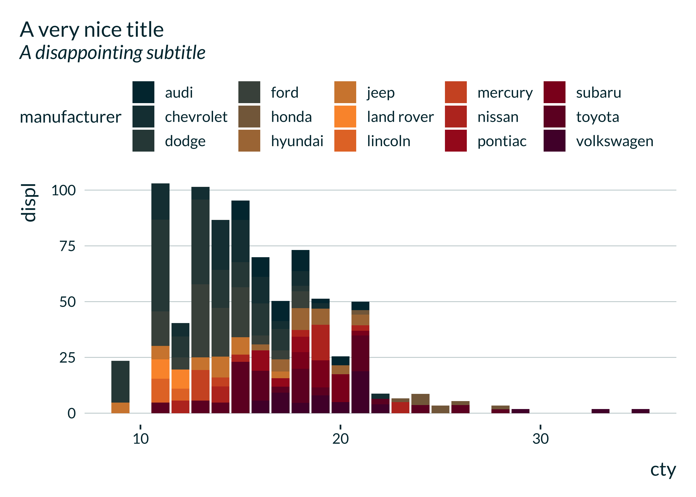
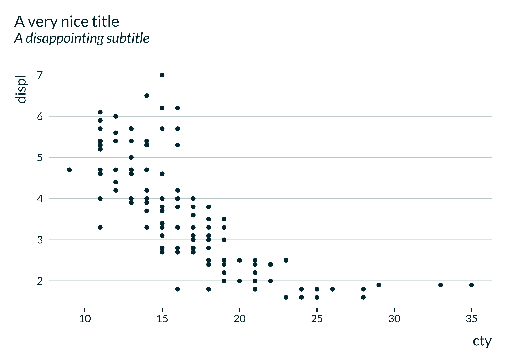
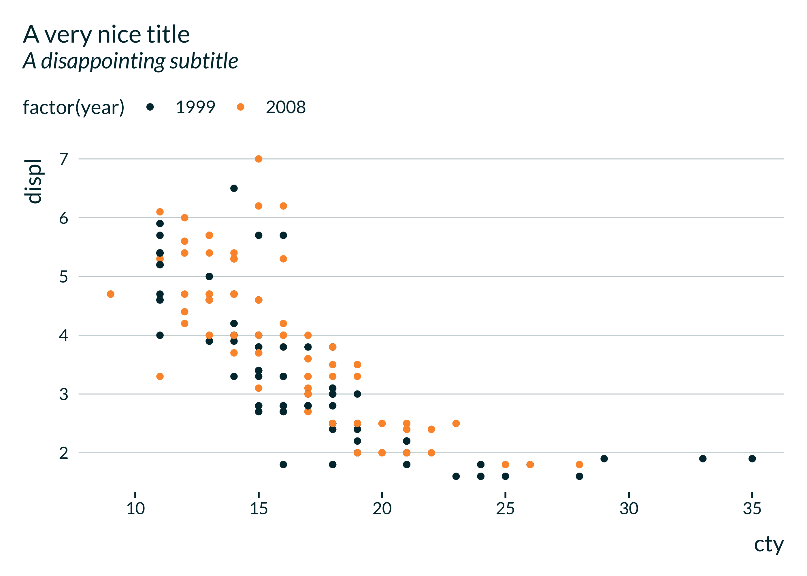
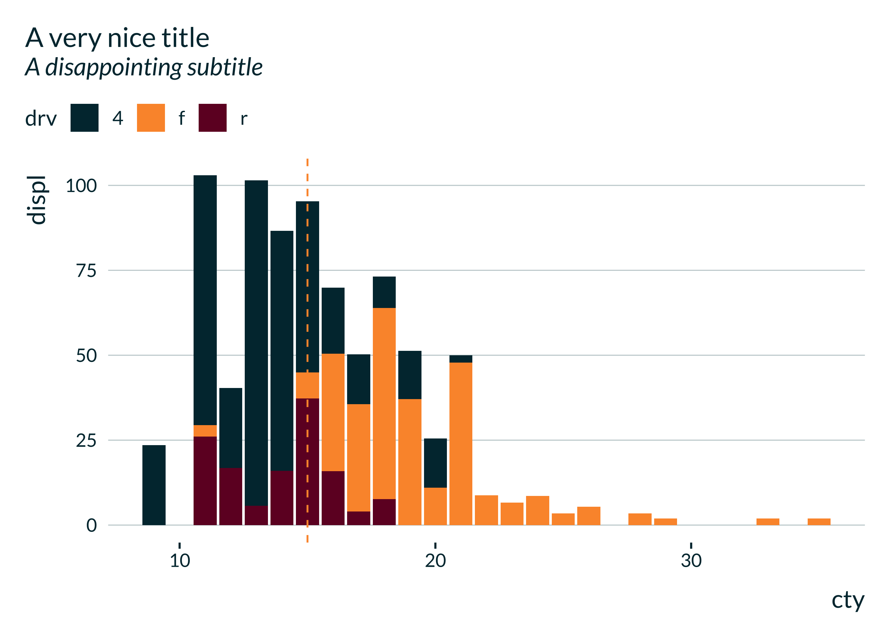
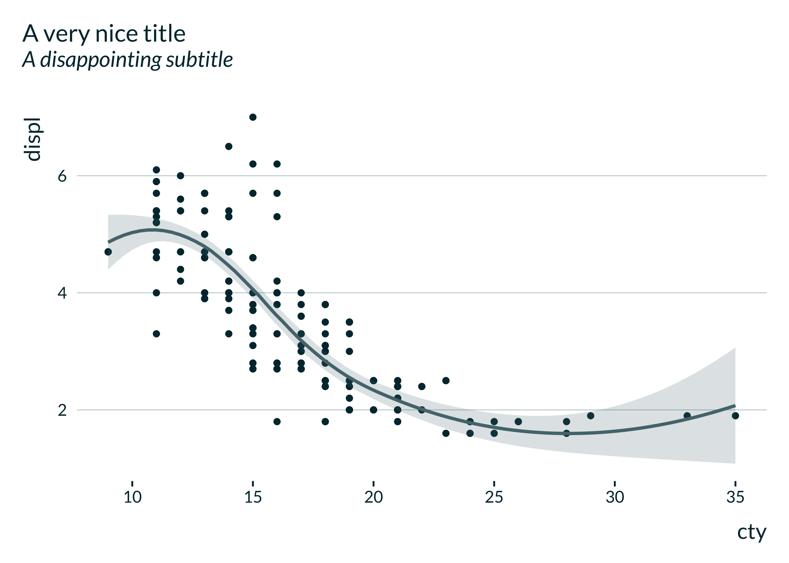
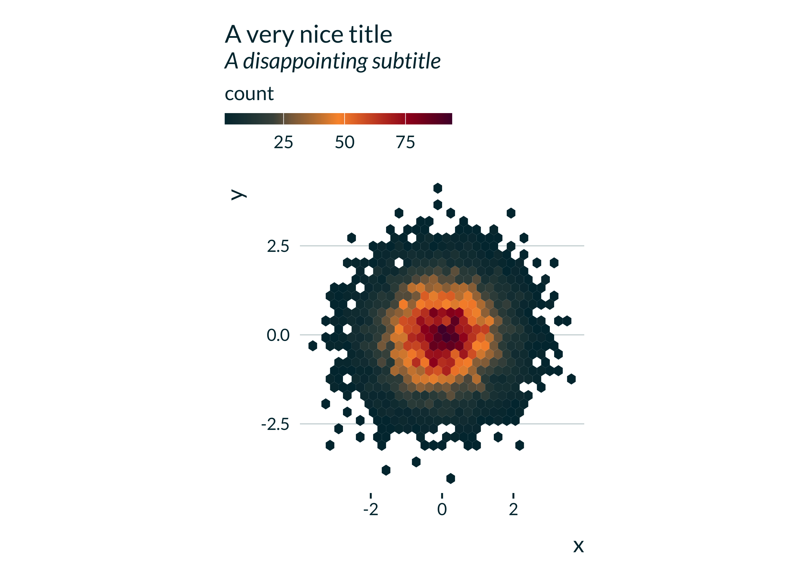
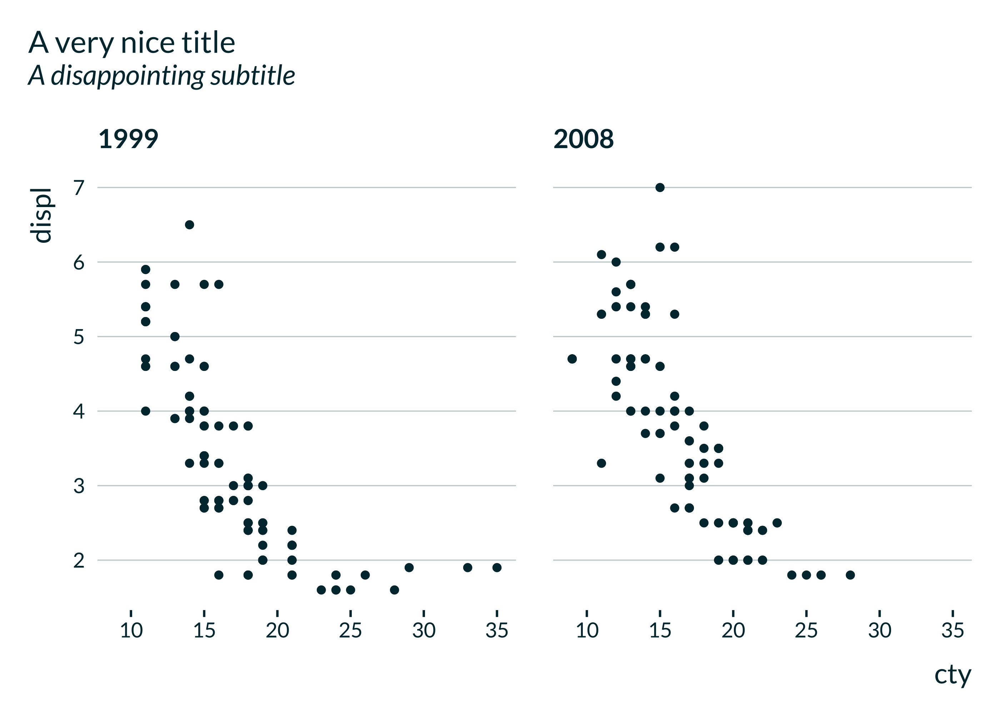
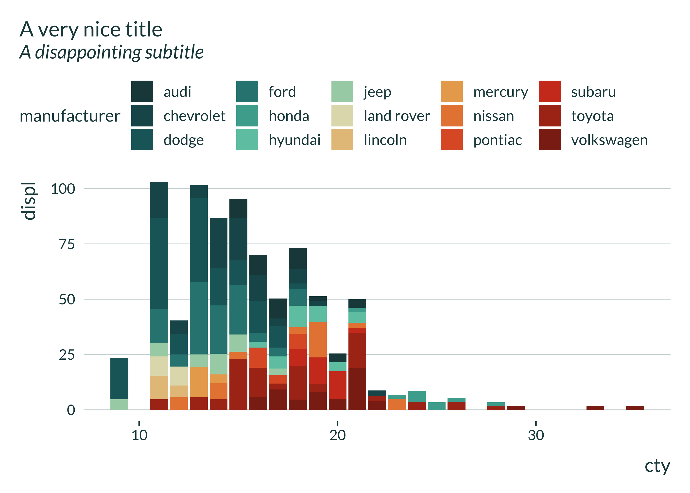

<!-- README.md is generated from README.Rmd. Please edit that file -->

# mediocrethemes

<!-- badges: start -->
<!-- badges: end -->

This package provides not particularly nice and, hopefully, not
particularly ugly ggplot themes.

## Installation

You can install the development version of `mediocrethemes` from
[GitHub](https://github.com/vincentbagilet/mediocrethemes) with:

``` r
# install.packages("devtools")
devtools::install_github("vincentbagilet/mediocrethemes")
```

Note that you may need to restart your R session once the installation
is complete to be able to use the package. You will also need an active
internet connection the first time you call `set_mediocre_all` or
`theme_mediocre`.

## Usage

This package provides both a ggplot theme and a color palette.

Users can set the theme and color palette for all plots in a document
with the function `set_mediocre_all` placed at the top of their
document:

``` r
library(ggplot2)
library(mediocrethemes)

set_mediocre_all()

ggplot(data = ggplot2::mpg, aes(x = cty, y = displ, fill = manufacturer)) +
    geom_col() +
    labs(title = "A very nice title", subtitle = "A disappointing subtitle")
```



Users also can set the theme and color palette independently.

``` r
ggplot(data = ggplot2::mpg, aes(x = cty, y = displ)) +
    geom_point() +
    theme_mediocre() +
    scale_mediocre_d() +
    labs(title = "A very nice title", subtitle = "A disappointing subtitle")
```



## Examples

### General examples

A couple of example plots obtained with this theme:



### Additional palettes

Note that additional palettes are available: autumn, rainbow, green,
hotcold, blackandwhite, coty, leo, portal, pem.

    #> [1] "set_mediocre_all(pal = 'rainbow')"


    #> [1] "set_mediocre_all(pal = 'green')"


    #> [1] "set_mediocre_all(pal = 'hotcold')"


    #> [1] "set_mediocre_all(pal = 'blackandwhite')"


    #> [1] "set_mediocre_all(pal = 'coty')"



    #> [1] "set_mediocre_all(pal = 'leo')"


    #> [1] "set_mediocre_all(pal = 'portal')"


    #> [1] "set_mediocre_all(pal = 'pem')"


Most palettes are divergent but can be turned into two gradient
palettes, as described in the [vignette](mediocrethemes.html).
