<!-- README.md is generated from README.Rmd. Please edit that file -->

# mediocrethemes

<!-- badges: start -->
<!-- badges: end -->

This package provides not particularly nice and, hopefully, not
particularly ugly ggplot themes.

## Installation

You can install the development version of `mediocrethemes` from
[GitHub](https://github.com/vincentbagilet/mediocrethemes) with:

``` r
# install.packages("devtools")
devtools::install_github("vincentbagilet/mediocrethemes")
```

Note that you may need to restart your R session once the installation
is complete to be able to use the package. You will also need an active
internet connection the first time you call `set_mediocre_all` or
`theme_mediocre`.

## Usage

This package provides both a ggplot theme and a color palette.

Users can set the theme and color palette for all plots in a document
with the function `set_mediocre_all` placed at the top of their
document:

``` r
library(ggplot2)
library(mediocrethemes)

set_mediocre_all()

ggplot(data = ggplot2::mpg, aes(x = cty, y = displ, fill = manufacturer)) +
    geom_col() +
    labs(title = "A very nice title", subtitle = "A disappointing subtitle")
```


Users also can set the theme and color palette independently.

``` r
ggplot(data = ggplot2::mpg, aes(x = cty, y = displ)) +
    geom_point() +
    theme_mediocre() +
    scale_mediocre_d() +
    labs(title = "A very nice title", subtitle = "A disappointing subtitle")
```


## Examples

### General examples

A couple of example plots obtained with this theme:

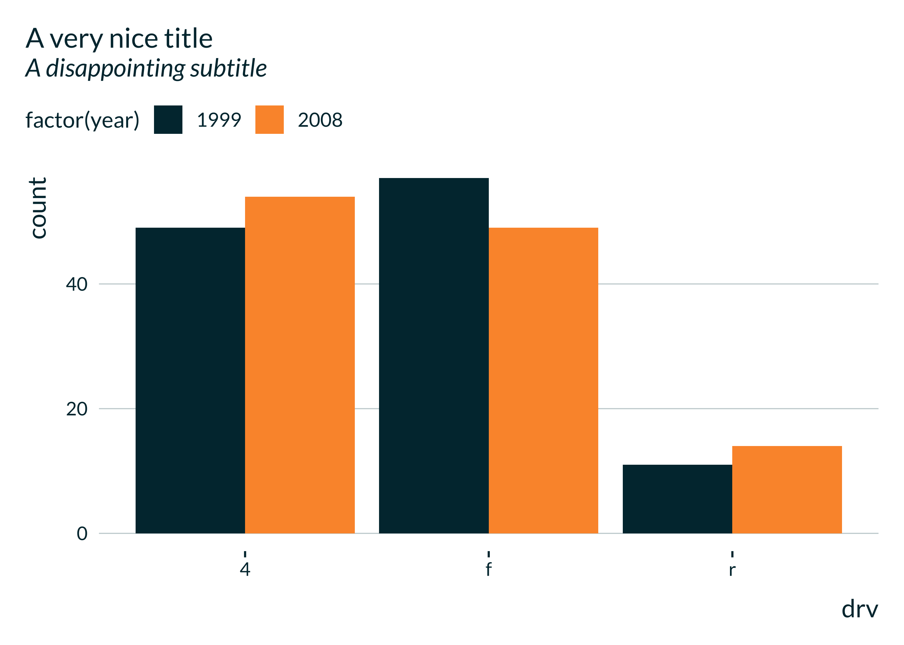

### Additional palettes

Note that additional palettes are available. Most palettes are divergent
and can be turned into two gradient palettes. This is done by splitting
a divergent palette in the middle, and use either the set of colors on
the right or on the left (flipped to get light colors for small values).

#### rainbow

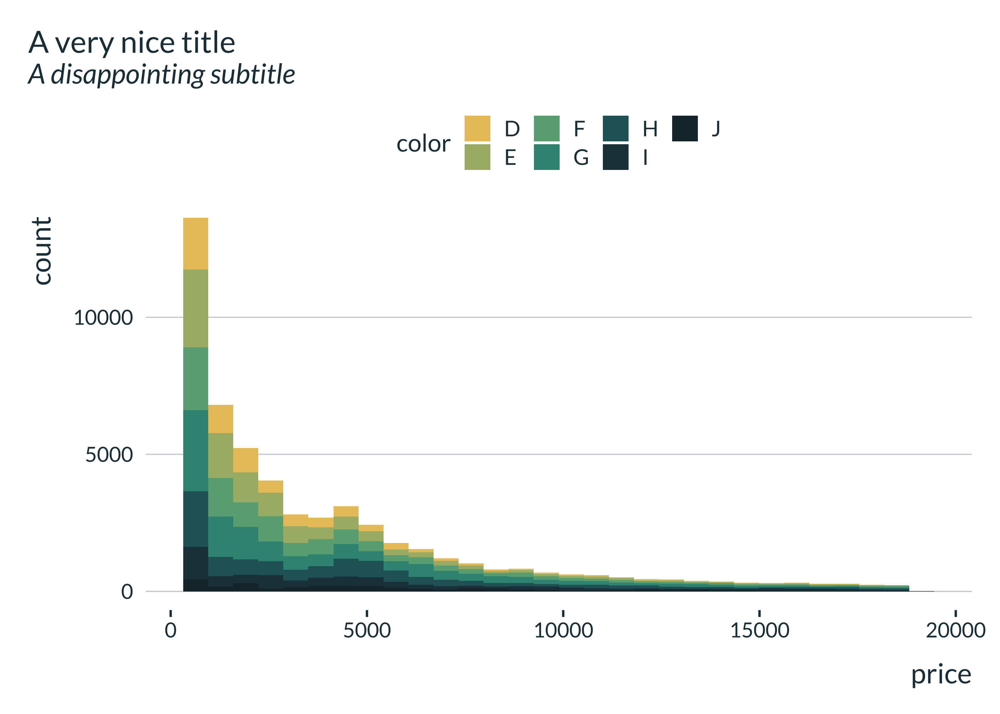

#### coty

A (tentatively) colorblind friendly palette, based on [a NPR
map](https://www.npr.org/2016/04/18/474256366/why-americas-schools-have-a-money-problem?t=1614618030346).

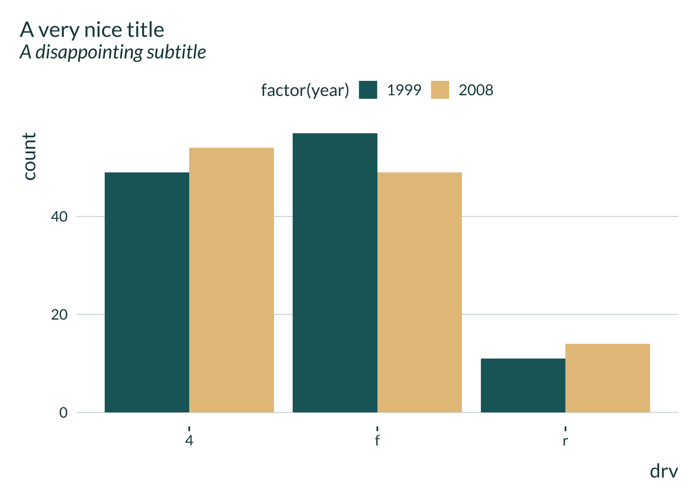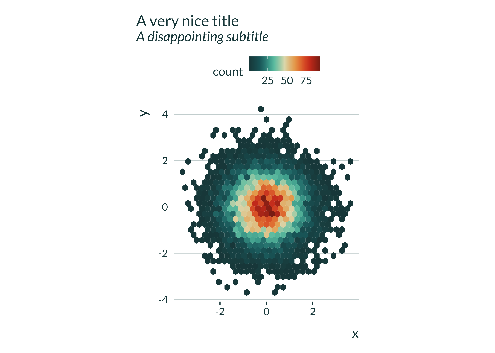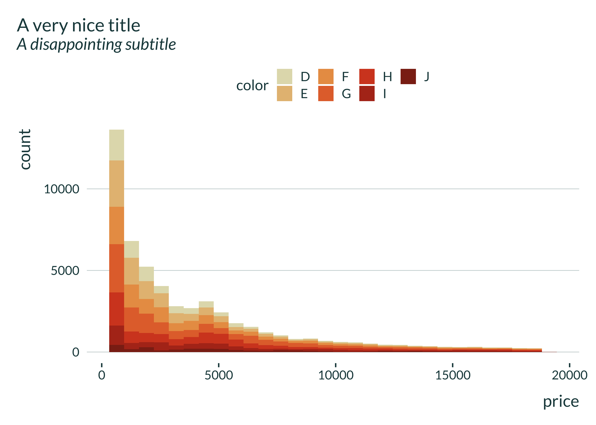

#### hotcold

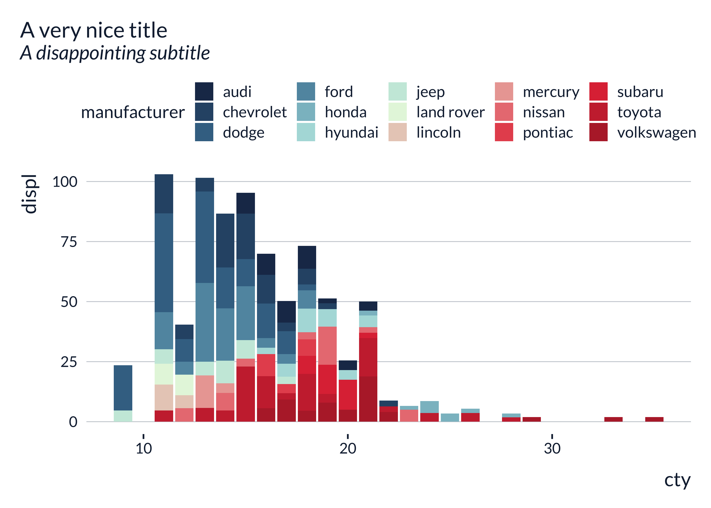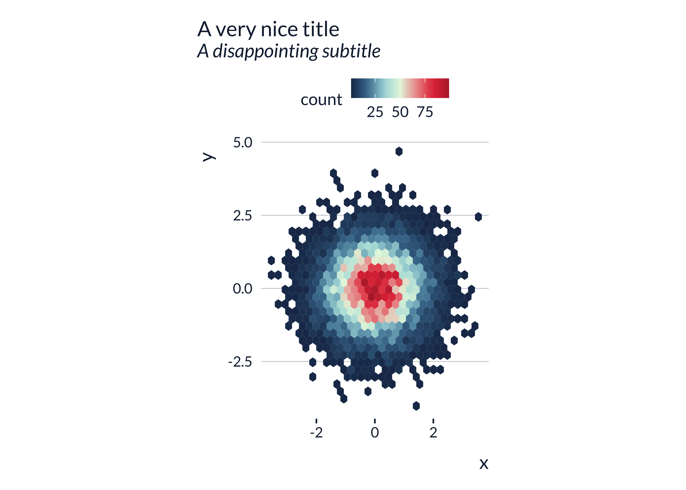

#### blackandwhite

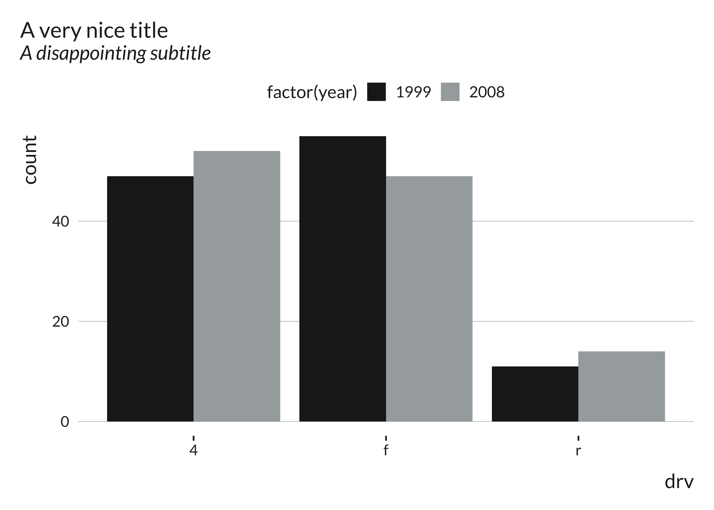

#### leo

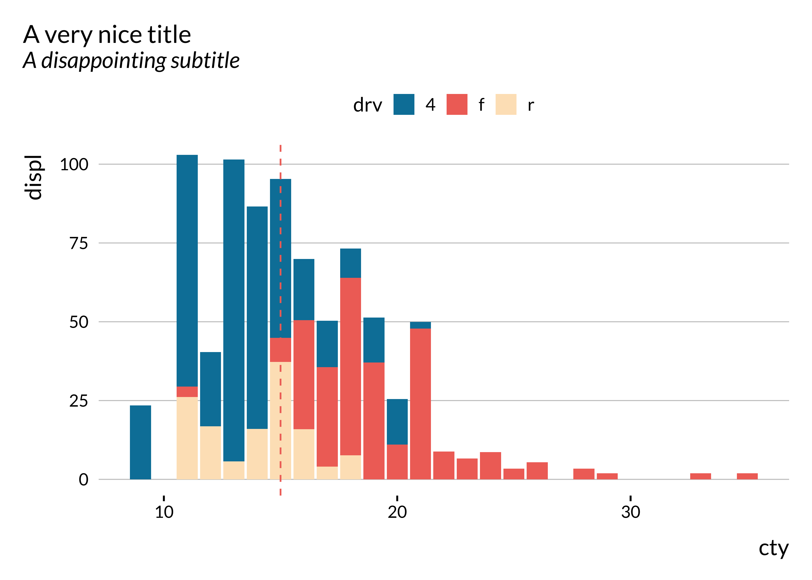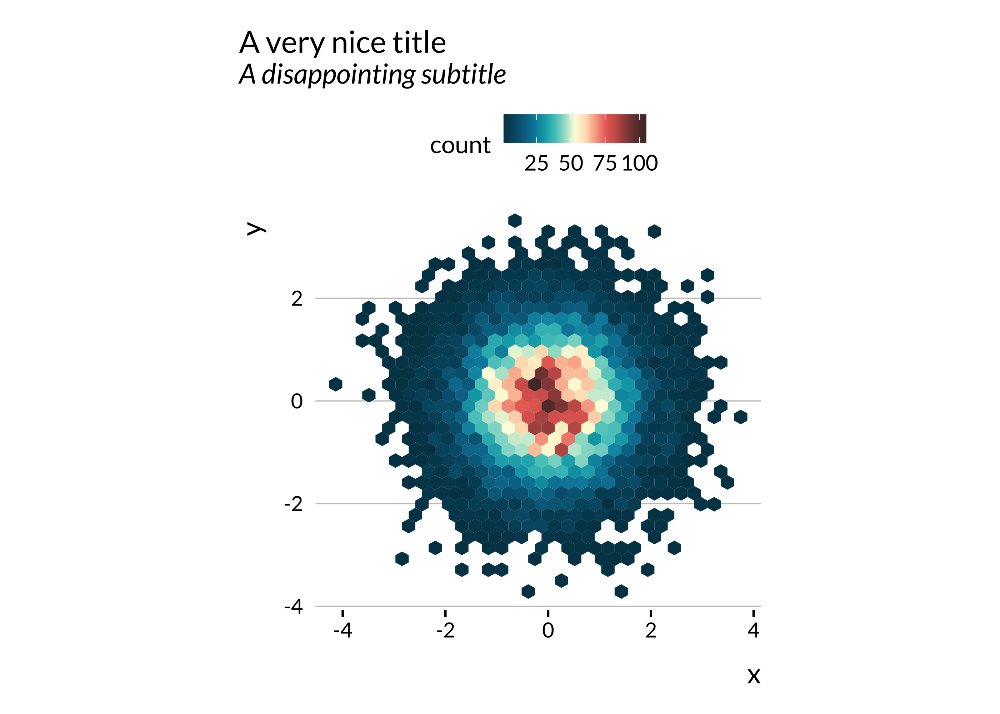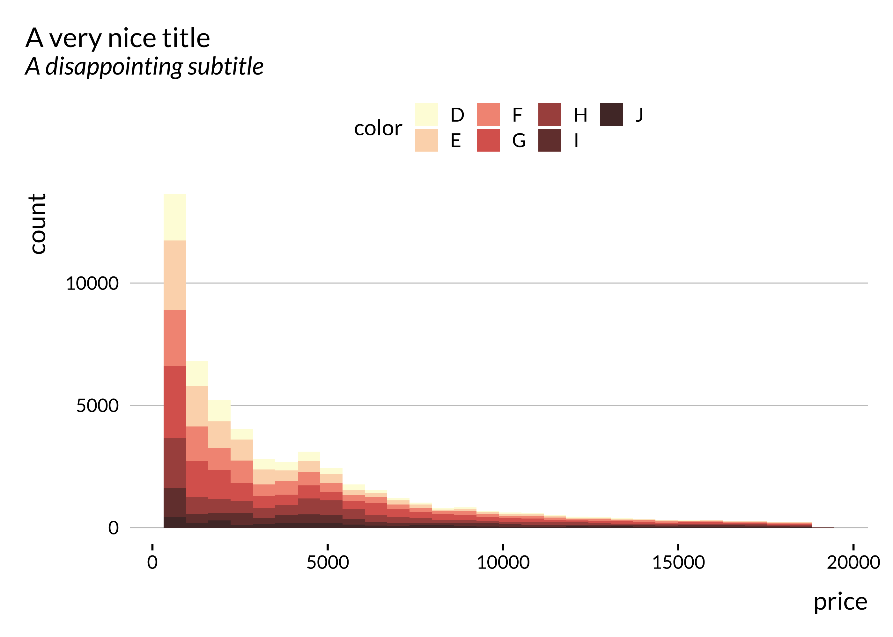

#### portal

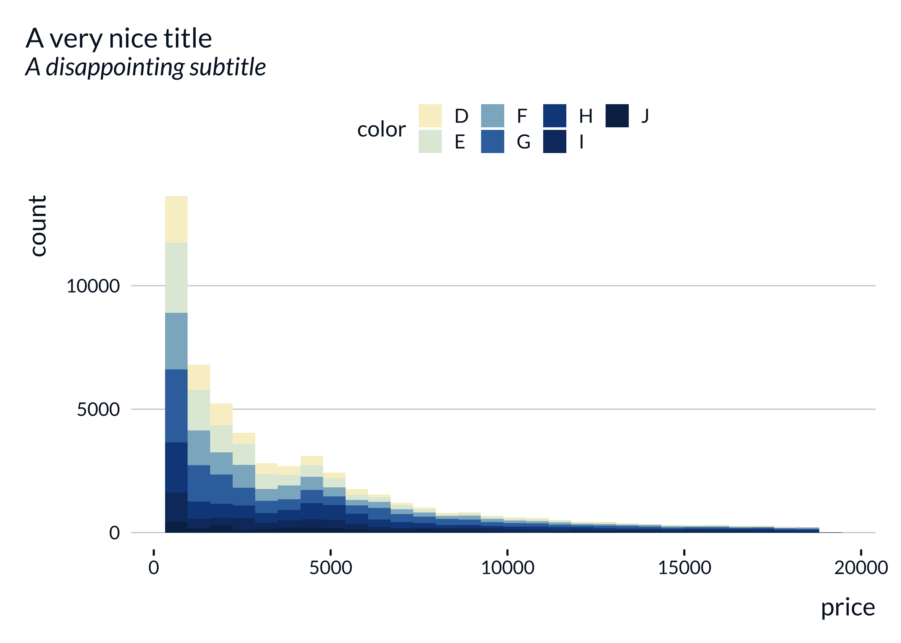

#### pem

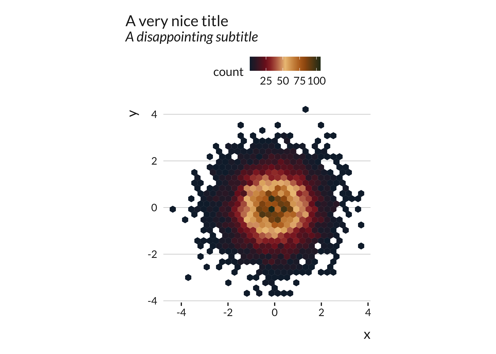
