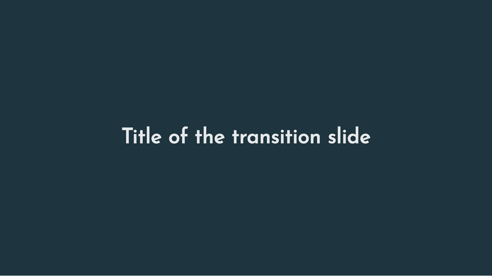

```{r, include = FALSE}
knitr::opts_chunk$set(
  collapse = TRUE,
  comment = "#>",
  # fig.path = "man/figures/README-",
  out.width = "70%",
  dpi = 400,
  fig.align = "center",
  dev = "png",
  fig.width = 7,
  fig.height = 5
)
```

This vignette illustrates how to build [`xaringan`](https://github.com/yihui/xaringan) slides in a style consistent with `mediocrethemes`. This is simply an application of the [`xaringanthemer`](https://pkg.garrickadenbuie.com/xaringanthemer/) package. 

This vignette assumes that you are familiar with `xaringan` slides. If not, please refer to [this presentation](https://slides.yihui.org/xaringan/#1) by Yihui Xie, the creator of the `xaringan` package.

## Example

Before anything, let's have a look at the type of slides this theme can produce:

```{r echo=FALSE, fig.align="center", dpi=500, out.width="100%"} 
knitr::include_graphics("images/example_xaringan.gif")
```

## Simple use

To build similar a similar template, add this to the YAML header of your slides:

```{YAML, eval=FALSE}
output:
  xaringan::moon_reader:
    css: mediocre-xaringan.css
    nature:
      countIncrementalSlides: no
      highlightLines: yes
      highlightStyle: github
      ratio: '16:9'
```

Note that `countIncrementalSlides`, `highlightLines` and `highlightStyle` are not necessary. However, `ratio` is necessary as font sizes are defined for 16:9 slides.

Then, add this to your set up chunk:

```{r create_css, eval=FALSE}
library(mediocrethemes)

xaringan_mediocre(pal = "coty")
```

You can use the palette of your choice. You may also need to add `knitr::opts_chunk$set(fig.showtext = TRUE)` to your setup chunk for the fonts to work properly.

You are all set!

## Example `.Rmd` file

Here is an example of a minimal `.Rmd` slide file:

````markdown
---
title: "A very nice title"
author: "Jeffrey Lebowski"
date: "April 34, 2103"
output:
  xaringan::moon_reader:
    lib_dir: libs
    css: mediocre-xaringan.css
    nature:
      countIncrementalSlides: no
      highlightLines: yes
      highlightStyle: github
      ratio: '16:9'
subtitle: "A disappointing subtitle"
---

`r ''````{r themer, include=FALSE}
library(tidyverse)
library(mediocrethemes)

xaringan_mediocre(pal = "coty")
```

# Lipsum latin words

- Lorem ipsum dolor sit amet, **sed sed sapien ac aliquam sollicitudin dapibus**.

- Ut elementum **efficitur penatibus**, taciti diam risus, donec.

````

## Nice xaringan features

Xaringan provides nice transition slides:

```{r echo=FALSE, fig.align="center", dpi=500, out.width="100%"} 

```

They can be created by adding the following lines to your code:

````markdown
---
class: inverse, middle, center

# Title of the transition slide
---
````


